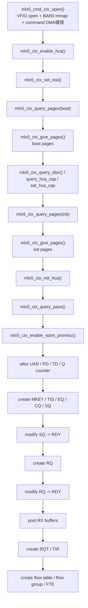
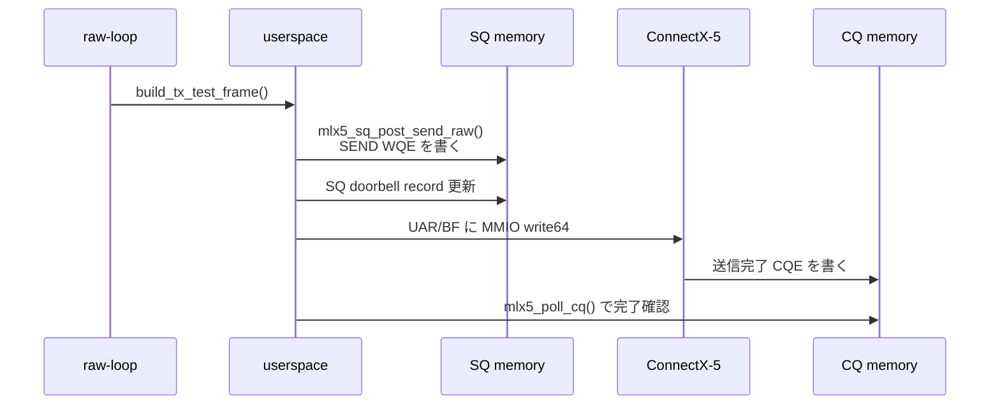
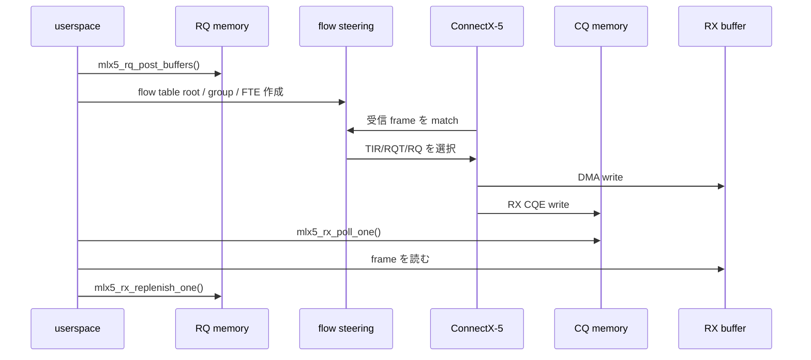
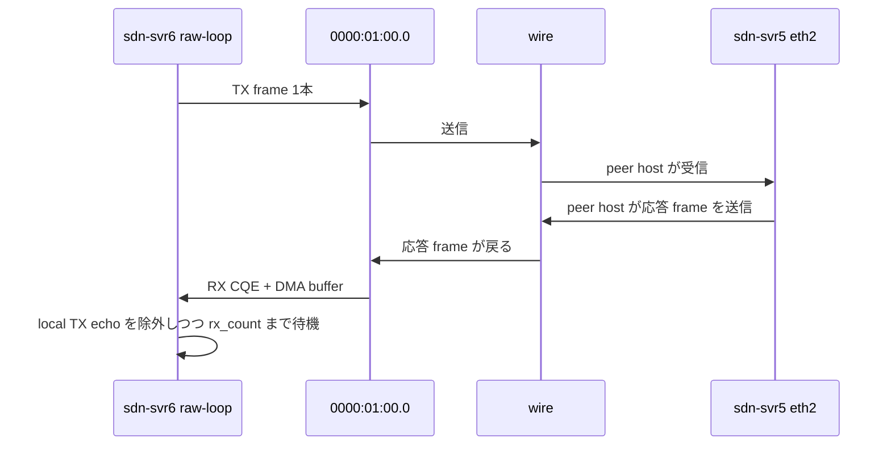

# mlxnicd 動作フロー

この文書は、`mlxnicd` が NIC を初期化し、raw packet を送受信する流れを
図で追うための補助資料です。`doc/overview.svg` が全体図なら、こちらは
`raw-loop` を基準にした時系列の説明です。

前提資料:

- 背景知識: [fundamentals.md](/home/sora/work/mlxnicd/doc/fundamentals.md)
- 全体図: [overview.md](/home/sora/work/mlxnicd/doc/overview.md)
- 実装解説: [README.md](/home/sora/work/mlxnicd/README.md)

## 1. 入口

CLI から見た入口は単純です。

- `main()` が `raw-loop` サブコマンドを解釈する
- `raw_loop_run()` が必須引数を検証する
- 実際の NIC bring-up と datapath 実行は `mlx5_raw_loop()` から
  `mlx5_run_profile()` に集約される

## 2. 初期化シーケンス

`raw-loop` はまず command path で HCA と queue object を立ち上げます。

この段階で重要なのは次の 3 点です。

- command path の仕事
  - HCA 初期化、cap 設定、各 object 作成はすべて firmware command で行う
- datapath 準備の仕事
  - SQ/CQ ができると TX 可能になる
  - RQ/RQT/TIR/flow table ができると RX を NIC 側で steering できる
- `raw-loop` 固有の設定
  - `create_rx_flow_table = 1`
  - `wait_rx = 1`
  - `skip_local_tx_on_rx = 1`

## 3. TX フロー

TX は full-inline SEND WQE を 1 本だけ投げるシンプルな経路です。

補足:

- フレームは `build_tx_test_frame()` で組み立てる
- payload は `--payload-hex` を使わなければ既定値が入る
- current 実装は full-inline 前提なので、送信サイズには上限がある

## 4. RX フロー

RX は「RQ に buffer を置く」「flow table で TIR に流す」「CQE を待つ」の
3 段に分かれます。

`raw-loop` では wait 中に自分が送った TX frame も同じポートで見えることが
あるため、`skip_local_tx_on_rx` で自分自身の送信を除外します。

## 5. raw-loop の end-to-end

`raw-loop` は「自分で 1 発送る」「peer から返ってきた複数 packet を待つ」
という実験コマンドです。

このコマンドが成功すると、概念的には次を確認できています。

- userspace からの command path 初期化が通った
- full-inline SEND で wire に出せた
- flow steering 付き RX object 群が機能した
- DMA された受信 frame を userspace 側で回収できた

## 6. 実装の対応先

図とコードの対応は次です。

- CLI 入口: [src/main.c](/home/sora/work/mlxnicd/src/main.c)
- `raw-loop` 引数検証: [src/raw.c](/home/sora/work/mlxnicd/src/raw.c)
- bring-up / TX / RX 本体: [src/mlx5.c](/home/sora/work/mlxnicd/src/mlx5.c)

特に追うと分かりやすい関数:

- `mlx5_raw_loop()`
- `mlx5_run_profile()`
- `mlx5_sq_post_send_raw()`
- `mlx5_wait_for_rx_packets()`
- `mlx5_test_runtime_cleanup()`
